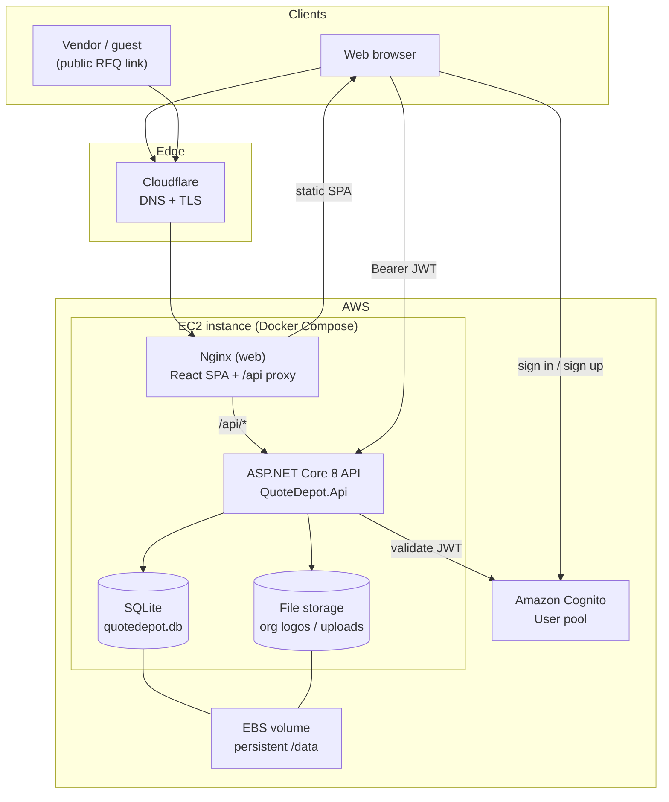

# Quote Depot

**Live app:** [https://waquotedepot.com](https://waquotedepot.com)

Part of **Warehouse Anywhere** — a place for warehouse and logistics teams to raise RFQs, collect vendor bids, and compare quotes in one workflow.

---

## What it does

Quote Depot helps organizations run a simple request-for-quote (RFQ) process:

1. **Sign in** with email/password (via Amazon Cognito).
2. **Join or create an organization** on first login — create a new org, accept an invite, or request to join an existing one.
3. **Publish requests** — org members open RFQs and share a public link with vendors.
4. **Collect quotes** — guests or signed-in users submit bids at `/r/{slug}`.
5. **Review and decide** — admins move quotes through `Draft → Submitted → Under Review → Accepted | Rejected`. Accepting one quote closes the request and rejects competing active bids.
6. **Audit and membership** — owners and admins review a lightweight audit trail and manage who belongs to the org.

### Roles

| Role | What they can do |
| ---- | ---------------- |
| **Owner** | Full org control (one per org — the creator) |
| **Admin** | Invite/revoke members, approve join requests, manage requests and quotes, accept quotes |
| **Member** | Create and manage requests, view quotes; no membership administration |

---

## Built with

| Layer | Technology |
| ----- | ---------- |
| **Frontend** | React 19, Vite, TypeScript, Tailwind CSS, React Router |
| **Backend** | ASP.NET Core 8 Web API |
| **Data** | Entity Framework Core + SQLite |
| **Authentication** | Amazon Cognito (email/password) |
| **Hosting** | AWS EC2, Docker Compose, Nginx |
| **Edge / TLS** | Cloudflare |
| **Tests** | xUnit (backend), Playwright (E2E, planned) |

---

## Architecture

Traffic flows from the browser through Cloudflare to a single EC2 instance running two Docker containers: Nginx serves the React SPA and proxies API calls to the ASP.NET backend. The API reads and writes a SQLite database and file uploads on persistent EBS storage. Authentication is handled by Amazon Cognito; the API validates JWTs on each protected request.



### Backend structure

The API follows a layered layout:

| Project | Responsibility |
| ------- | -------------- |
| `QuoteDepot.Api` | HTTP controllers, auth middleware, application services |
| `QuoteDepot.Domain` | Entities, enums, state machines, domain rules |
| `QuoteDepot.Infrastructure` | EF Core `DbContext`, SQLite, local file storage |

### Key routes

| Route | Purpose |
| ----- | ------- |
| `/` | Landing — sign in or sign up |
| `/signin` | Authentication (sign in / sign up tabs) |
| `/r/{slug}` | Public RFQ page for vendor quote submission |
| `/api/*` | REST API (organizations, requests, quotes, dashboard, audit) |

---

## Repository layout

```
backend/          ASP.NET Core API, domain, and infrastructure
frontend/         Vite + React + TypeScript + Tailwind
tests/backend/    xUnit integration tests
tests/e2e/        Playwright (planned)
deploy/           Docker Compose and infrastructure notes
docs/             Product goal and developer tooling reference
```

For local development and deployment details, see [docs/TOOLS.md](docs/TOOLS.md) and [deploy/README.md](deploy/README.md).
